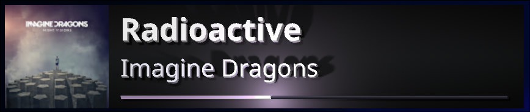

# EinBaumCurrentlyPlaying

Borderless "now playing" overlay for OBS, drawn with Vulkan. Shows album cover, title, artist, and
progress bar on a green chroma-key card.



Reads the OS media session: SMTC on Windows, MPRIS over D-Bus on Linux.

## OBS

Add a Window/Game Capture source, then a Chroma Key filter, Key Color green (`#00FF00`).

## Run

```
EinBaumCurrentlyPlaying
EinBaumCurrentlyPlaying --debug # shows fps counter
EinBaumCurrentlyPlaying --http  # enables HTTP API
```

## API

`--http` enables `GET http://127.0.0.1:18881/`

```json
{
  "valid": true,
  "title": "Song",
  "artist": "Artist",
  "playing": true,
  "live": false,
  "duration": 234.5,
  "position": 12.3
}
```

## Requirements

- GPU with a Vulkan 1.2 driver.
- Windows 10/11 x64, or Linux + Wayland.

## Build

CMake (Ninja) on both platforms.

**Windows** — [MSYS2](https://www.msys2.org/) UCRT64:

```
pacman -S mingw-w64-ucrt-x86_64-{gcc,cmake,ninja,shaderc,vulkan-headers}
cmake -S . -B build-windows -G Ninja -DCMAKE_BUILD_TYPE=Release
cmake --build build-windows   # -> build-windows\EinBaumCurrentlyPlaying.exe
```

**Linux** — needs `glslc`, `wayland-scanner`, wayland-protocols, vulkan, freetype2, fontconfig, libsystemd:

```
cmake -S . -B build-linux -G Ninja -DCMAKE_BUILD_TYPE=Release
cmake --build build-linux     # -> build-linux/EinBaumCurrentlyPlaying
```
